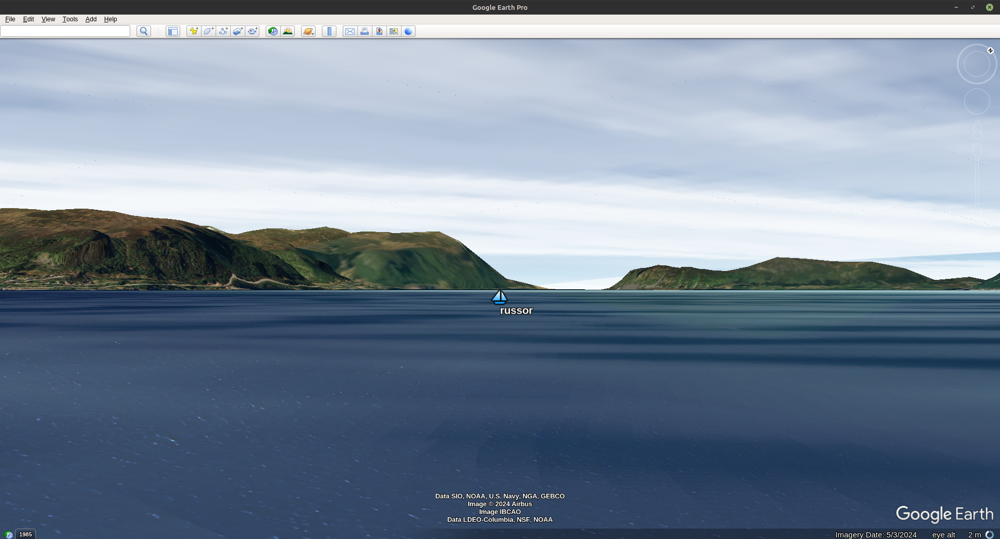

# Virtual Regatta Google Earth View

Realistic 3D look for the [Virtual Regatta](https://www.virtualregatta.com/en/offshore-game/).
Especially fine for shore views.

This progect uses [Protege ontology editor for frames - Protege 3.5](https://protege.stanford.edu/download/protege/3.5/installanywhere/Web_Installers/) and
Chrome browser with
[VR Dashboard I.T.Y.C extencion](https://chromewebstore.google.com/search/I.T.Y.C%20Dashboard?utm_source=ext_app_menu)
This edition is clearly for Java. For Python see [rururu/VRGoogleEarthView](https://github.com/rururu/VRGoogleEarthView)

[](https://www.youtube.com/watch?v=-mU8IFLJL6w)
Click the screenshot to see a video!

## Prerequisites

You need to be installed on your machine:

1. Java 21 and above.

1. Chrome or Firefox browser.

2. [VR Dashboard I.T.Y.C extencion](https://chromewebstore.google.com/search/I.T.Y.C%20Dashboard?utm_source=ext_app_menu)

## Installation

If you have git installed on your machine, you can using an OS command

```shell
$ cd <some folder>
$ git clone https://github.com/rururu/VRGoogleEarthView.git
```
and get in that folder a new folder __pro-virtual-regatta__.
Otherwise you can download zip-file using the button "Code" on this page and unzip it in a new folder with the same name.
 
## Usage

1. Open "Virual Regatta" page in a browser.
2. Activate "VR Dashboard" extension.
3. Enter into the race.
4. Check "Sortie 8081" on "VR Dashboard" extension page (once, if needed).
5. Allow a file run.sh (run.bat for Windows) to be executable (once, if needed).
6. Start VRGoogleEarthView program:

```shell
$ cd <..>/pro-virtual-regatta
$ ./run.sh       # Linux, MacOS
$ run.bat        # Windows
```
7. Once initialization is complete, open the camera control using the corresponding button on the opened Protege GUI.
8. Start simulation with "Start" button on Camera Control.
9. Input or confirm a name of your boat.
10. Start Google Earth program.
11. Open Google Earth View -> Sidebar (if needed).
12. Open <..>/pro-virtual-regatta/LinkToCamera.kml file.
13. Open <..>/pro-virtual-regatta/LinkToFleet.kml file.


## Video Lesson

[Lesson 1](https://youtu.be/e0vCwdhOMXg)

## More Videos

1. [Around Fastnet Lighthouse 2025](https://youtu.be/0RJvrW5n3Sg)
2. [Japan spring run 2025. Kanmon strates](https://www.youtube.com/watch?v=f05fT74qrdg)
3. [Vendee Globe 2024. Crozet Islands](https://www.youtube.com/watch?v=-mU8IFLJL6w)
4. [Christmas race Helsinki - New York 2024. Start](https://www.youtube.com/watch?v=rzFJu84os68)
5. [Christmas race Helsinki - New York 2024. Finish](https://www.youtube.com/watch?v=w5J4xQFkwM0)
6. [Cape Town and Cape of Good Hope](https://youtu.be/NUErnVKNLAw)

_More detailed version: [https://github.com/rururu/sail-pro](https://github.com/rururu/sail-pro)_

Copyright © 2025 Ruslan Sorokin

